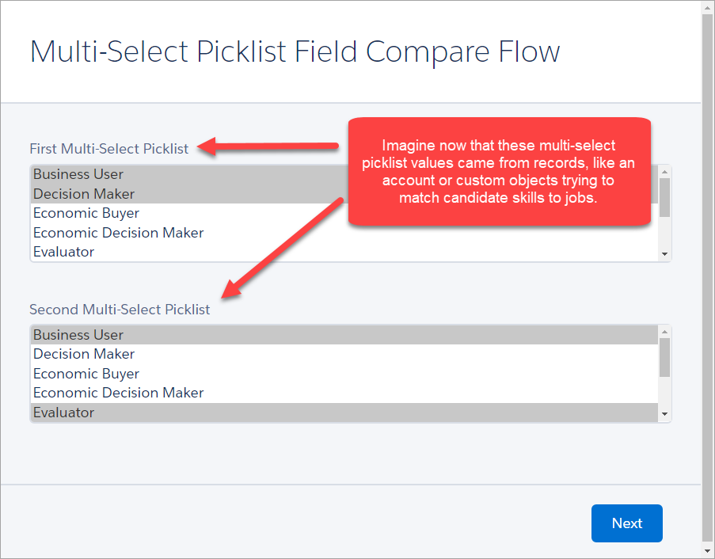
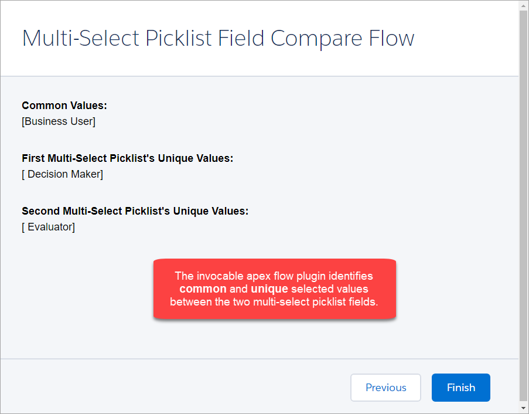
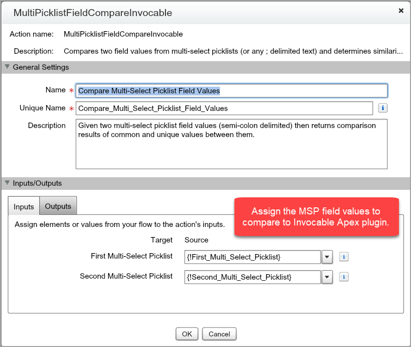
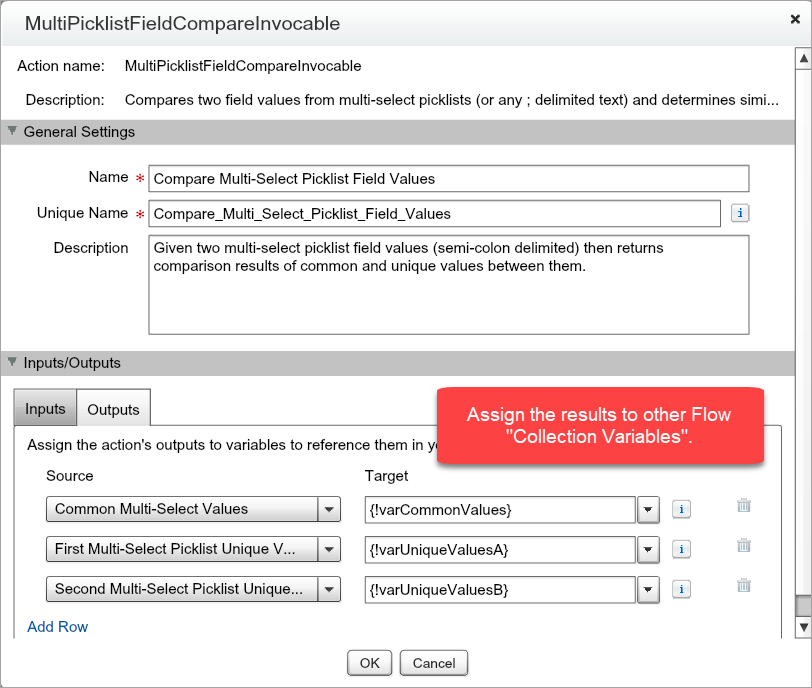

Multi-Select Picklist Field Compare
===================================

Overview
--------

Invocable Apex that compares two multi-select picklist fields and determines their common and unique values.
A simple flow is included in this project to demonstrate usage.

Inspired by [Jeffrey Berger](https://twitter.com/jeffereyberger/status/877246726112980992).

Getting Started
---------------

* [Deploy from Github](https://githubsfdeploy.herokuapp.com)
* In Setup, navigate to Flows and run **Multi-Select Picklist Field Compare Flow**

When you run the included demo flow you'll be prompted to choose values from two multi-select picklist fields.

Click the **Next** button to be shown the comparison of common and unique values.
The flow could have decisions to perform actions if one of the output variables is null or contains specific values.

Open the flow in the designer view. You can customize where the data for the first and second multi-select picklist field comes from.
They can come from screen input fields as per this example or from Salesforce records or any variable that has semi-colon (;) delimited text.

The invocable apex flow plugin produces three output variables:

1. Values common to both picklists
2. Values unique to the first picklist
3. Values unique to the second picklist

